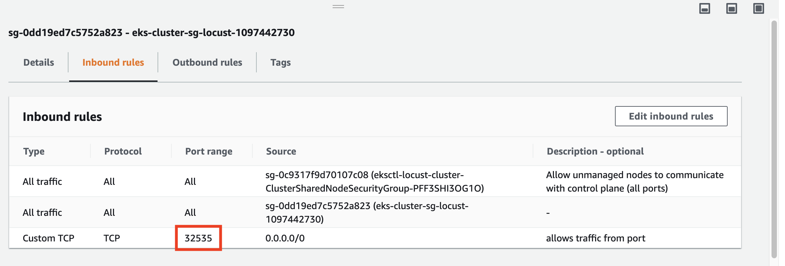

# Introduction

Distributed load testing using cloud computing is an attractive option for a variety of test scenarios.

Cloud platforms provide a high degree of infrastructure elasticity, making it easy to test applications and services with large numbers of simulated clients, each generating traffic patterned after users or devices.

Additionally, the pricing model of cloud computing fits very well with the very elastic nature of load testing.

Locust supports running load tests on multiple machines. It's a perfect fit for Kubernetes which makes distributed deployments, container orchestration and scaling easy.

In this installment of my Locust experiments, I'll prepare Kubernetes scripts for deploying and managing Locust cluster in AWS EKS and see if there are any surprises along the way.

I will also *NOT* be creating my own locust docker image and instead use the official [locustio/locust](https://hub.docker.com/r/locustio/locust/) image to make sure I use the latest locust version

# Locust distributed mode

Running Locust in distributed mode is described in its documentation.
In short:
* you can have one master and multiple slave nodes (workers)
* you need to tell the workers where the master is (give them the IP address and ports)
* you need to supply each worker with the tests code (locustfiles)
* the workers need to be able to connect to the master.

That's pretty much it.

# Kubernetes components
Let's dive in and go through the building blocks of the Locust cluster to be deployed.

Kubernetes' *configmaps* will help configure Locust.
[One configmap](./scripts-cm.yaml) will hold a proper locustfile and will be mounted as a volume to the master and workers,
[the second](./locust-cm.yaml) will contain other configuration settings (URL for tested host/service, for example) that will be injected to running Locust nodes as environment variables.


I'll use *deployment* in order to "ask" K8s for making sure our [master](./master-deployment.yaml) and [slaves](./slave-deployment.yaml) are up and running.
[The service](./service.yaml) will make the master addressable within the cluster.
[The nodeport](./nodeport.yml) will help give your nodes an External IP address to your nodes.

# Cluster deployment

To set up the cluster:

1) Create an EKS cluster via CLI. If you have an existing EKS cluster run `aws eks update-kubeconfig --name <name-of-eks-cluster>`

    > git clone https://github.com/karol-brejna-i/locust-experiments.git
    > cd locust-experiments
    > cd kubernetes
    > kubectl create -f nodeport.yaml -f scripts-cm.yaml -f master-deployment.yaml -f service.yaml -f slave-deployment.yaml

*kubectl* command connects to my minikube cluster and crate the components mentioned above.
If ran for the first time, it may take a while to complete (if there is no locust docker image on the cluster, it needs to be downloaded first).
To see, if locust nodes are running we can inspect if the pods are up:

    > kubectl get -w pods
    NAME                             READY     STATUS    RESTARTS   AGE
    locust-master-6dd5cc46d4-xrqt6   1/1     Running   0          26h
    locust-worker-bc7464db8-bs857    1/1     Running   0          26h
    locust-worker-bc7464db8-z84kp    1/1     Running   0          26h

From the output we can pick up the master name can also take a look at the logs.
`kubectl logs locust-master-754dc88dd8-zgs7m` should include the following information:

```
[2020-11-13 01:38:05,978] locust-master-6dd5cc46d4-xrqt6/INFO/locust.main: Starting web interface at http://:8089
[2020-11-13 01:38:05,989] locust-master-6dd5cc46d4-xrqt6/INFO/locust.main: Starting Locust 1.1
[2020-11-13 01:38:06,837] locust-master-6dd5cc46d4-xrqt6/INFO/locust.runners: Client 'locust-worker-bc7464db8-z84kp_324ebbc0df6f49c98c8198c8333195e1' reported as ready. Currently 1 clients ready to swarm.
[2020-11-13 01:38:07,220] locust-master-6dd5cc46d4-xrqt6/INFO/locust.runners: Client 'locust-worker-bc7464db8-bs857_03b4f012581b4af2be62cf9912f45538' reported as ready. Currently 2 clients ready to swarm.
```

We can see that the master has started (line 1 and 2) and the slaves "volunteer" to do some work (lines 3-4).

# Search for public IP and port.

You need to know what are the public address the nodes are interfacing so that you can access to it:

    > kubectl get nodes -o wide |  awk {'print $1" " $2 " " $7'} | column -t
    NAME                                         STATUS  EXTERNAL-IP
    ip-x-x-x-x.ap-southeast-1.compute.internal   Ready   x.x.x.x
    ip-y-y-y-y.ap-southeast-1.compute.internal   Ready   y.y.y.y

You also need to know what port are the NodePort service running on:
    > kubectl get service/locust-service
    NAME             TYPE       CLUSTER-IP     EXTERNAL-IP   PORT(S)          AGE
    locust-service   NodePort   10.100.3.131   <none>        8089:32535/TCP   26h

Go to your EKS Cluster security group and open the port for external access.


From there you access `http://x.x.x.x:32535` or `http://y.y.y.y:32535`
